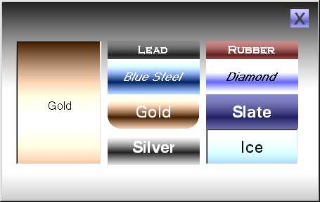



## Amazing Skin Machine

### Description

Everything you ever wanted to know about skins but were afraid to ask. Resize borderless controls without any work. Fabulous Metal skins and custom buttons with rounded corners. Move the form around with the mouse. Practical examples of SetWindowLong, SendMessage, SetWindowRgn. It's all here!!! Just Download the code and open the .vbg project group.
 
### More Info
 

             |
---                |---
**Submitted On**   |2000-12-29 15:44:46
**By**             |[John Edward Colman](https://github.com/Planet-Source-Code/PSCIndex/blob/master/ByAuthor/john-edward-colman.md)
**Level**          |Beginner
**User Rating**    |4.3 (64 globes from 15 users)
**Compatibility**  |VB 5\.0, VB 6\.0
**Category**       |[Graphics](https://github.com/Planet-Source-Code/PSCIndex/blob/master/ByCategory/graphics__1-46.md)
**World**          |[Visual Basic](https://github.com/Planet-Source-Code/PSCIndex/blob/master/ByWorld/visual-basic.md)
**Archive File**   |[CODE\_UPLOAD1314412292000\.zip](https://github.com/Planet-Source-Code/john-edward-colman-amazing-skin-machine__1-13935/archive/master.zip)

